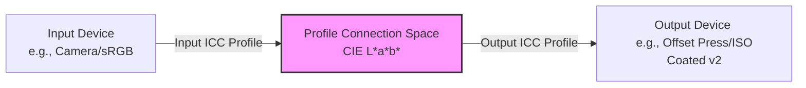

# Colour Management (Farbmanagement)

Colour management ensures that colors are represented consistently across different input, display, and output devices. Because devices like cameras, monitors, and printing presses use different technologies to produce color, a standardized translation system is necessary.

---

## 1. The Core Principle: Device-Independent Color

Every device has its own **Color Gamut** (Farbraum) — the range of colors it can physically display or print. 
*   **Device-Dependent Color Spaces:** RGB (monitors) and CMYK (printers) are device-dependent. For example, `RGB (255, 0, 0)` looks different on a budget TN panel than on a professional IPS monitor.
*   **Device-Independent Color Space:** To translate between these, colour management uses a reference color space based on human vision: **CIE L\*a\*b\*** (or CIE XYZ).

### The CIE L\*a\*b\* System
*   **L\* (Lightness):** Ranges from 0 (black) to 100 (white).
*   **a\* (Green-Red axis):** Negative values are green, positive values are red.
*   **b\* (Blue-Yellow axis):** Negative values are blue, positive values are yellow.

---

## 2. ICC Profiles & The PCS

An **ICC Profile** (International Color Consortium) is a file describing the color characteristics of a specific device (its gamut and color behavior).

The translation process uses a **Profile Connection Space (PCS)** (usually CIE L\*a\*b\*) as an intermediary. The **Color Management Module (CMM)** performs the mathematical conversion.

---

## 3. Important Color Spaces (Farbräume)

### RGB Color Spaces (Additive Mixing)
*   **sRGB:** Standard RGB. Small gamut, but the universal default for web, office monitors, and mobile devices.
*   **Adobe RGB (1998):** Larger gamut, particularly in green and cyan tones. Essential for professional photography and print preparation.
*   **ProPhoto RGB:** Extremely large gamut. Includes colors human eyes cannot see. Used in raw photo processing to prevent data clipping.

### CMYK Color Spaces (Subtractive Mixing)
Unlike RGB, CMYK profiles are tailored to specific paper types and printing processes:
*   **PSO Coated v3 (FOGRA51):** The current European standard for sheet-fed offset printing on glossy or matte coated paper.
*   **PSO Uncoated v3 (FOGRA52):** The standard for printing on uncoated (offset) paper.
*   **ISO Coated v2 (FOGRA39):** The older but still widely used standard for coated paper.

---

## 4. Rendering Intents (Renderprioritäten)

When converting colors from a larger gamut (e.g., Adobe RGB) to a smaller gamut (e.g., CMYK), some colors will fall outside the target gamut ("out of gamut"). The **Rendering Intent** dictates how these out-of-gamut colors are handled:

| Rendering Intent (German) | How it Works | Best Used For |
| :--- | :--- | :--- |
| **Perceptual** *(Perzeptiv / Fotografisch)* | Scales the entire color gamut down proportionally. All colors change slightly, but visual relationships and details are preserved. | Continuous-tone photographs with many out-of-gamut colors. |
| **Relative Colorimetric** *(Relativ farbmetrisch)* | Maps in-gamut colors exactly. Out-of-gamut colors are compressed to the nearest reproducible edge. The source white point is adjusted to the destination white point (paper tint). | Standard layouts, vector designs, and high-fidelity photos. |
| **Absolute Colorimetric** *(Absolut farbmetrisch)* | Maps in-gamut colors exactly, but **does not** adjust for the target paper tint. Instead, it simulates the source paper color by printing a light tint. | Digital Contract Proofing (checking how it will print on the final paper). |
| **Saturation** *(Sättigung)* | Prioritizes bright, saturated colors over accuracy. Exact hues may shift. | Business graphics, charts, and diagrams where vibrancy matters more than realism. |

---

## 5. Calibration vs. Characterization

To keep a monitor accurate, you must follow two distinct steps using a colorimeter or spectrophotometer:
1.  **Calibration (Kalibrierung):** Adjusting the physical hardware settings of the monitor (luminance, white point, gamma) to a target standard (e.g., D50/D65 white point, 120 cd/m² brightness, Gamma 2.2).
2.  **Characterization (Profilierung):** Measuring how the calibrated monitor displays specific color values, and generating a unique ICC profile (.icc/.icm) that tells software how to adjust outputs.

---

## 6. Proofing (Prüfdrucke)

Proofing allows designers to simulate and check print results before going to press.

### Softproof (Bildschirm-Proof)
A software simulation of the print results directly on the monitor (e.g., in Photoshop or InDesign using `View > Proof Setup`). Requires a calibrated wide-gamut monitor.

### Hardproof / Contract Proof (Prüfkopie)
A physical printout created on a calibrated inkjet printer to simulate the final offset press.
*   **Requirements (according to ISO 12647-7):**
    *   Must use the correct target profile (e.g., PSO Coated v3).
    *   Must include the **Ugra/Fogra Media Wedge** (Medienkeil) for spectrophotometric verification.
    *   Must be printed on certified proofing paper.
    *   Must show a pass status sticker after measurement.
