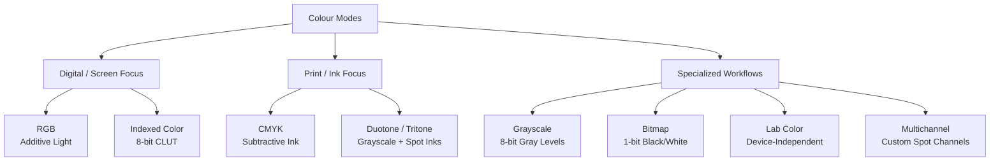
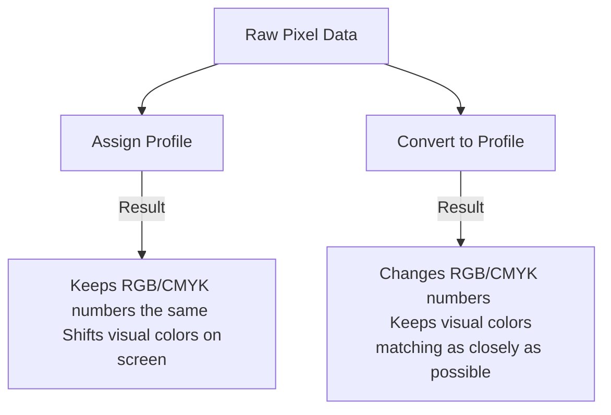

# Colour Modes and Profiles

Understanding the difference between **colour modes** and **colour profiles** is crucial for ensuring that a design looks consistent from the initial screen layout to the final printed product or digital display. 

A common pitfall is treating these concepts interchangeably. They are distinct levels of colour definition:
*   **Colour Mode (Color Space Model):** Defines the mathematical system used to represent colours (e.g., RGB uses light channels; CMYK uses ink percentages).
*   **Colour Profile (ICC Profile):** Acts as a translation guide that maps those mathematical values to actual, physical colours on a specific device (e.g., a specific monitor, phone screen, or offset printing press).

---

## 1. Core Colour Modes Explained

Digital design applications use several color modes, each tailored to specific production workflows.

### A. RGB (Red, Green, Blue)
*   **How it works:** **Additive** color mixing. Red, green, and blue light are combined in varying intensities (typically from 0 to 255 per channel in an 8-bit image) to project colours. When all three are at 255, they produce pure white.
*   **Best Used For:** All digital displays (websites, UI/UX, video, social media, mobile apps).
*   **Gamut:** Large. It can display vibrant, highly saturated neon colours that cannot be replicated with physical ink.

### B. CMYK (Cyan, Magenta, Yellow, Key/Black)
*   **How it works:** **Subtractive** color mixing. Pigments absorb (subtract) light reflecting off paper. Cyan, magenta, yellow, and black inks are printed as tiny halftone dot patterns. When all four are at 100%, they produce a dark, muddy brown/black (which is why a separate "Key" black ink is used for crisp text and deep shadows).
*   **Best Used For:** Commercial printing and physical production (offset, digital press, screen printing).
*   **Gamut:** Small. Subtractive ink mixing cannot reproduce the brightness of illuminated screen pixels, leading to duller or shifted colours if converted incorrectly.

### C. Grayscale (Graustufen)
*   **How it works:** Uses a single channel to store lightness values. In an 8-bit image, it displays 256 levels of gray ranging from 0 (pure black) to 255 (pure white).
*   **Best Used For:** Black-and-white printing, optimizing file sizes, or creating masking/luminance channels.

### D. Bitmap (1-bit / Black and White)
*   **How it works:** Uses exactly two colour values per pixel: pure black or pure white. There are no shades of gray. Because each pixel is represented by a single bit (on/off), file sizes are incredibly small.
*   **Best Used For:** Line art, signatures, engraving prep, and high-resolution scanned drawings.

### E. Lab Color (CIE L\*a\*b\*)
*   **How it works:** A device-independent model based on human vision.
    *   **L (Lightness):** 0 to 100.
    *   **a (Green-Red axis):** Negative values are green, positive are red.
    *   **b (Blue-Yellow axis):** Negative values are blue, positive are yellow.
*   **Best Used For:** Precise color corrections, separating luminance from color information in Photoshop, and as the internal translation hub (PCS) for colour engines.

### F. Indexed Color
*   **How it works:** Restricts the image to a maximum of 256 colours stored in a **Color Lookup Table (CLUT)**. If a colour is not in the table, the application approximates it using dithering (patterns of pixels).
*   **Best Used For:** Web graphics with flat areas of color (like early GIFs or PNG-8) where minimizing file size is critical.

### G. Duotone / Tritone / Quadritone
*   **How it works:** A grayscale image printed using one, two, three, or four custom inks (such as Pantone spot colors). This creates stylized, rich monochrome or duotone prints without using standard CMYK separations.
*   **Best Used For:** High-end print brochures, artistic photography, and branding materials.

### H. Multichannel
*   **How it works:** Contains multiple 8-bit grayscale channels. Unlike standard modes, there are no default composite channels. Photoshop creates one channel for every ink color specified.
*   **Best Used For:** Specialized packaging print workflows, flexography, and printing designs that require multiple spot colours (e.g., metallic and neon inks) on a single sheet.

---

## 2. Illustrator vs. Photoshop: Handling Colour Modes

Photoshop and Illustrator handle colour modes differently because of their core underlying architectures (raster pixels vs. vector paths).

| Feature | Adobe Photoshop (Raster / Pixel) | Adobe Illustrator (Vector / Path) |
| :--- | :--- | :--- |
| **Colour Mode Scope** | **Per-Document (Image > Mode)**. The entire document runs on one mode, but individual layers can hold Smart Objects with different modes. | **Per-Document (File > Document Color Mode)**. Strictly limited to either **RGB** or **CMYK** at the document level. |
| **Channel Editing** |  **Direct access**. You can edit the Red, Green, Blue, or CMYK channels individually using brushes, filters, or adjustments. | ❌ **No direct channel editing**. Vectors are mathematically rendered; channels are generated dynamically during export or print. |
| **Supported Modes** | RGB, CMYK, Lab, Grayscale, Bitmap, Indexed, Duotone, Multichannel. | RGB, CMYK (other assets must be converted or rasterized to fit these two). |
| **Spot Colors** | Handled through **Spot Channels** in the Channels panel. | Handled via **Spot Color Swatches** (e.g., Pantone) directly in the Swatches panel. |

### How Illustrator Manages RGB and CMYK
Because Illustrator files are designed for output flexibility, vector assets within a document are rasterized or exported according to the overall **Document Color Mode**:
*   If your document is in CMYK mode, any imported RGB raster images will be rendered through the CMYK space, warning you if colours fall out of gamut.
*   If your document is in RGB mode, print-specific options like Spot Colors are simulated using RGB values, and exporting to PDF will convert vector paths into RGB.

> [!IMPORTANT]
> Avoid mixing colour spaces inside an Illustrator file. If you are designing for print, set your Document Color Mode to CMYK *before* creating assets to ensure your colour swatches reflect printable ink limits.

---

## 3. Colour Profiles: The Translation Layer

A colour mode provides the recipe, but a **Colour Profile (ICC Profile)** defines how it tastes on a specific device. Without a profile, RGB and CMYK values are just raw, arbitrary numbers.

For example:
*   `RGB (240, 10, 10)` represents a bright red.
*   On a standard office monitor, it looks slightly washed out.
*   On a high-end mobile OLED display, it looks intensely saturated.
*   By embedding the **sRGB** colour profile, the application tells the display's colour management engine how to adjust the physical pixels so the red looks identical on both screens.

### Common Working Spaces (Working Profiles)

#### RGB Working Spaces
*   **sRGB (IEC61966-2.1):** The universal standard. Smallest gamut, but supported by virtually all web browsers, screens, and consumer printers. Use this for all web and screen exports.
*   **Adobe RGB (1998):** Larger gamut, capturing a wider range of cyan and green tones. Excellent for photographers and designers preparing files that will eventually go to print.
*   **ProPhoto RGB:** An exceptionally wide gamut that contains colors beyond human vision. Used by raw image processors (like Lightroom) to preserve image data before exporting to a smaller space.

#### CMYK Working Spaces
CMYK profiles depend heavily on the paper stock and printing method:
*   **PSO Coated v3 / ISO Coated v2 (FOGRA39):** The standards for high-quality printing on glossy or matte coated papers (common in Europe).
*   **PSO Uncoated v3 (FOGRA52):** Used for printing on matte, textured, or porous uncoated papers, which absorb ink and reduce color saturation.
*   **US Web Coated (SWOP) v2:** The standard for web offset printing on coated paper (common in North America).

---

## 4. Photoshop Concept: Assign Profile vs. Convert to Profile

In Adobe Photoshop, managing profiles incorrectly can ruin colors. Under `Edit`, you will find two options: **Assign Profile** and **Convert to Profile**.

### Assign Profile (Profil zuweisen)
*   **What it does:** Changes the profile label *without* altering the underlying pixel numbers.
*   **When to use it:** When a file has **no profile** (untagged) and you want to tell Photoshop which profile it was designed in, or if you want to intentionally distort colors for creative effect.
*   **Risk:** If you assign Adobe RGB to an sRGB image, the colors will shift and look overly saturated and incorrect.

### Convert to Profile (In Profil konvertieren)
*   **What it does:** Changes the underlying pixel numbers to preserve the visual appearance of the image in the new color space.
*   **When to use it:** When you want to move an image from one color space to another (e.g., preparing a photo in Adobe RGB for the web by converting it to sRGB, or converting it to a CMYK profile for a printing press).
*   **Result:** The colors look virtually identical on screen, but the raw color values (e.g., the RGB values) are re-calculated to match the target profile's gamut boundaries.

---

## 5. Summary Quick Reference

| Task | Color Mode | Working Profile | Application Action |
| :--- | :--- | :--- | :--- |
| **Designing a Website or Mobile App UI** | RGB | sRGB | **Illustrator:** Set File > Document Color Mode > RGB.  **Photoshop:** Export using "Save for Web" or "Export As" with "Convert to sRGB" enabled. |
| **Editing Photos for Web/Social Media** | RGB | sRGB | **Photoshop:** Edit in sRGB, or convert from Adobe RGB before exporting. |
| **Designing an Offset Printed Brochure** | CMYK | PSO Coated v3 (Europe) or SWOP v2 (US) | **Illustrator:** Set File > Document Color Mode > CMYK. Use Pantone swatches for spot elements. |
| **Scanning Hand-drawn Sketches** | Bitmap | None | **Photoshop:** Scan in Grayscale first, adjust Threshold, then convert to Bitmap mode to clean up edges. |
| **Fine Art Photography Archiving** | RGB | Adobe RGB or ProPhoto RGB | **Photoshop:** Edit in 16-bit depth to prevent color banding in wide gamut profiles. |
