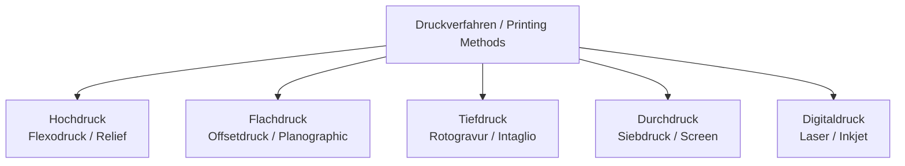
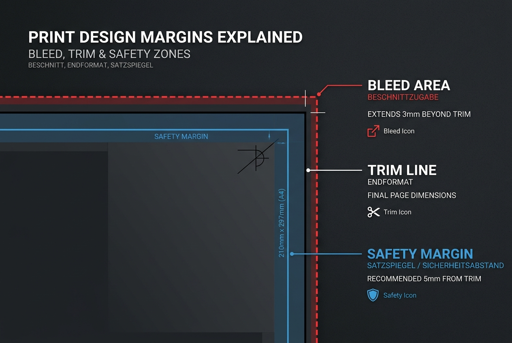

# Print Production (Drucktechnik)

Understanding how files are printed and processed is a core component of the Media Designer curriculum. You must master the five main printing techniques, prepress setup, and PDF/X delivery standards.

---

## 1. The Five Main Printing Processes (Die fünf Hauptdruckverfahren)

Printing techniques are categorized by how the image carrier transfer ink. Below are the key characteristics of each:

### A. Hochdruck (Relief Printing)
*   **Principle:** The printing parts are raised (higher) than the non-printing parts. Ink is rolled onto the raised areas and transferred directly to the medium.
*   **Main Process:** **Flexodruck** (using flexible photopolymer plates).
*   **Typical Products:** Plastic packaging, carrier bags, napkins, wallpaper.
*   **Identification Mark:** Slight squeeze edges (**Quetschränder**) around letters and a slight relief structure on the back of the paper.

### B. Flachdruck (Planographic Printing)
*   **Principle:** The printing and non-printing parts are on the same level. It works on the chemical principle that oil (ink) and water repel each other.
*   **Main Process:** **Offsetdruck** (indirect printing where ink transfers from plate to rubber blanket, then to paper).
*   **Typical Products:** Books, brochures, flyers, high-run magazines, packaging boxes.
*   **Identification Mark:** Very sharp edges, uniform ink coverage, no marks on the back of the paper.

### C. Tiefdruck (Intaglio Printing)
*   **Principle:** The printing parts are recessed (engraved cells). The entire cylinder is inked, scraped clean with a steel blade (**Rakel**), and ink remaining in the cells is sucked out by the paper.
*   **Main Process:** **Rotationstiefdruck** (using heavy copper/chromium cylinders).
*   **Typical Products:** Catalogues with millions of copies, high-run magazines, decorative foil.
*   **Identification Mark:** Jagged edges (**Sägezahneffekt**) on fonts and lines because everything (even text) is broken into halftone cells.

### D. Durchdruck (Screen/Stencil Printing)
*   **Principle:** Ink is pushed through a fine mesh screen. Non-printing areas are blocked with a stencil.
*   **Main Process:** **Siebdruck**.
*   **Typical Products:** T-shirts/textiles, wood, glass, ceramics, large posters, promotional items.
*   **Identification Mark:** Very thick, tactile ink layer; mesh structure sometimes visible under a magnifier.

### E. Digitaldruck (Digital Printing)
*   **Principle:** No physical plate is needed. The print image is transferred electronically directly onto paper/substrates using electrophotography (toner) or inkjet (ink).
*   **Typical Products:** Variable data printing, personalized mailings, short-run flyers, posters.
*   **Identification Mark:** Glossy toner layer on top of paper fibers; easily visible micro-dots under magnification.

---

## 2. Deep Dive: Offset Printing Mechanics

Offset printing is the workhorse of commercial printing. It is an **indirect process**, meaning the printing plate never touches the paper.

1.  **Platemaking (CTP - Computer to Plate):** Thermal lasers write the image directly onto aluminum plates.
2.  **Dampening (Feuchtwerk):** Water dampens the plate. Non-image areas are hydrophilic (water-attracting) and accept the water.
3.  **Inking (Farbwerk):** Greasy ink is applied. Image areas are lipophilic (grease-attracting) and repel the water, accepting the ink.
4.  **Blanket Cylinder (Gummituchzylinder):** The ink transfers from the plate to a flexible rubber blanket. This prevents wearing down the plate and allows printing on textured surfaces.
5.  **Impression Cylinder (Druckzylinder):** Presses the paper against the blanket cylinder to transfer the image.

---

## 3. Prepress Checklist (Druckvorstufe)

To ensure a file prints correctly without errors, it must undergo a preflight check based on these parameters:

*   **Color Mode:** Must be CMYK (plus optional Spot Colors / Sonderfarben). No RGB files should be left.
*   **Resolution:** 
    *   Continuous-tone images (photos): **300 PPI** at final size.
    *   Line art (bitmaps): **1200 PPI** for crisp edges.
*   **Bleed (Beschnitt):** Minimum **3mm** on all sides. All full-bleed elements must extend to the bleed boundary.
*   **Safety Margin (Sicherheitsabstand):** Keep text and logos at least **4-5mm** away from the trim line to prevent them from being cut off during high-speed binding.
*   **Overprint vs. Knockout (Überdrucken vs. Aussparen):**
    *   Black text should usually **overprint** so no white gaps show if alignment shifts.
    *   Colored elements should **knock out** the underlying color to prevent unwanted mixing.

---

## 4. PDF/X Standards

The PDF/X series (PDF for eXchange) is a subset of the PDF standard optimized for print delivery, stripping out non-printable elements like video, interactive buttons, and web links.

*   **PDF/X-1a:** The most restrictive standard. Only CMYK and spot colors are allowed. No RGB, no transparency (all transparent layers must be flattened).
*   **PDF/X-3:** Allows color-managed workflows. ICC profiles and device-independent color spaces (like RGB or L\*a\*b\*) are permitted alongside CMYK. Transparencies must still be flattened.
*   **PDF/X-4:** The current standard. Supports live transparencies (rendering engines handle transparency flattening during print RIP), layers, and color management (RGB/CMYK profiles).
